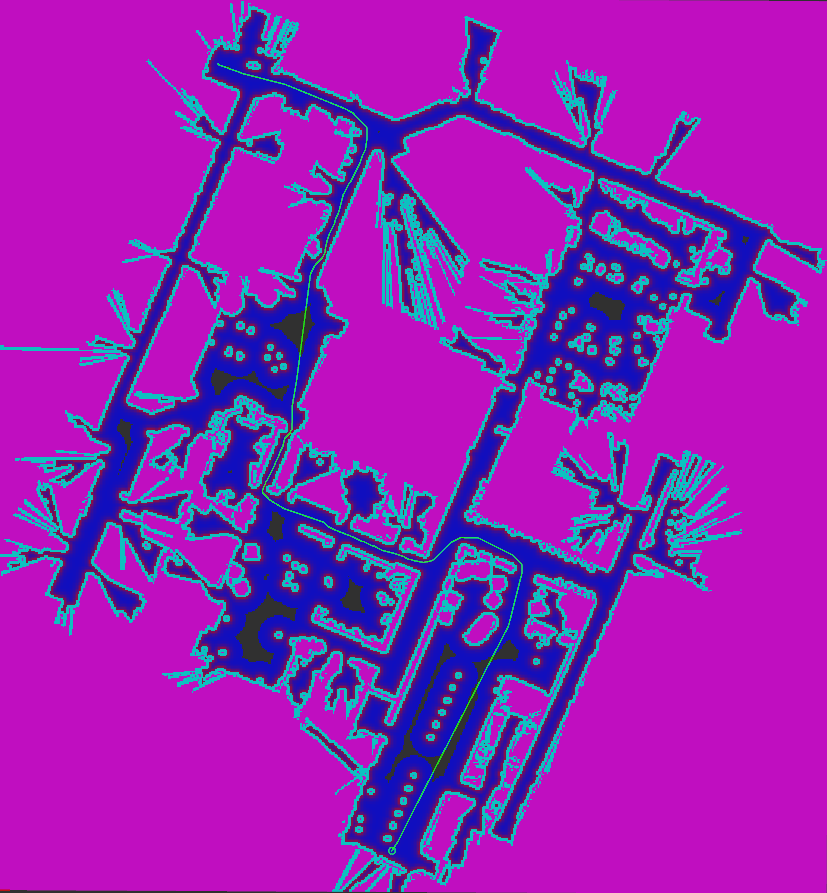

# Basic Theta Star Planner
这个仓库主要用于学习ros2中实现的 Basic Theta*算法，主要改动是添加了一些代码注释来便于阅读和理解代码。

## 特征
- 规划器使用 A* 搜索和视线 (LOS) 检查来形成任意角度路径，从而避免通常的 A* 实现中可能出现的之字形路径
- 由于它还考虑了执行过程中的代价地图遍历成本，因此它倾向于自动平滑路径，从而减轻平滑路径的需要（急转弯的存在取决于地图的分辨率，并且随着地图分辨率的增加而减少）
- 使用成本图中的成本来惩罚高成本区域
- 允许将路径行为控制为任意角度定向或位于空间中间
- 非常适合全向和差动驱动类型的小型机器人

## 指标

对于下面的示例，规划器花费了 46ms（平均值）来计算 87.5m 的路径 


参数设置： `w_euc_cost: 1.0`, `w_traversal_cost: 5.0`和 `global_costmap`的`inflation_layer`： `cost_scaling_factor:5.0`, `inflation_radius: 5.5`

## 成本函数详细信息

### 符号及其含义

**g(a)** - 节点a的成本函数成本

**h(a)** - 节点a的启发式函数成本

**f(a)** - 节点a的总成本 (g(a) + h(a))

**LETHAL_COST** - a value of the costmap traversal cost that inscribes an obstacle with
respect to a function, value = 253

**curr** - 表示其邻居被添加到列表中的节点

**neigh** - curr 的相邻节点之一

**par** - curr 的父节点

**euc_cost(a,b)** - 节点a和节点b之间的欧氏距离

**costmap_cost(a,b)** - 节点a和节点b之间的成本图遍历成本（范围为 0 - 252，254 = 未知值）

### 代价函数

```
g(neigh) = g(curr) + w_euc_cost*euc_cost(curr, neigh) + w_traversal_cost*(costmap_cost(curr,neigh)/LETHAL_COST)^2
h(neigh) = w_heuristic_cost * euc_cost(neigh, goal)
f(neigh) = g(neigh) + h(neigh)
```
### **参数**

- Theta*规划器的参数有：

  - .how_many_corners参数：

  ```
  数据类型：int
  默认值：8
  描述：要在4个连接（上、下、左、右）和8个连接（所有相邻单元格）图形扩展之间进行选择，即可接受的值为4和8。
  ```

  - .w_euc_cost参数：

  ```
  数据类型：double
  默认值：1.0
  描述：用于设置施加在路径长度上的权重。
  ```

  - .w_traversal_cost参数：

  ```
  数据类型：double
  默认值：2.0
  描述：此参数会调整高成本节点受到惩罚的严厉程度。从上面的 g(neigh) 方程中可以看出，成本函数的成本感知组件形成了一条抛物线，所以此参数的值增大时会使该曲线更陡峭，从而会导致不同成本节点之间更大的差异（当曲线变陡峭，成本增量也会随之增大）。
  ```

  - .w_heuristic_cost参数：

  ```
  数据类型：double
  默认值：1.0
  描述：用于提供一个可接受的启发式方法，以便推荐值仅在请求时更改其值。通常将此参数值设置为与w_euc_cost参数值相同或1.0（以较小者为准），但可以增大w_heuristic_cost参数的值以加快进程。
  ```
## 使用说明

### 调整参数

这个规划器使用`global_costmap`中与每个单元相关的成本作为衡量该点与障碍物的接近程度。建议提供一个覆盖整个区域的温和的势场（从而导致只有像成本=0的小口袋区域），以实现穿过空间中间的路径。一个好的起点是将膨胀层的参数设置为：`cost_scaling_factor: 10.0, inflation_radius: 5.5，`然后降低`cost_scaling_factor`的值以实现上述势场。

在该区域提供一个温和的势场，使规划者能够用路径长度的增加换取累积穿越成本的减少，从而导致与障碍物的距离增加。这样在转角处可以自然地平滑转弯，并消除了对外部路径平滑器的要求。

`w_heuristic_cost`是用户不可更改的内部设置。它被提供给一个可接受的启发式，将其值限制为`w_euc_cost`和`1.0`的最小值，以确保启发式和旅行成本是可接受的和一致的。

首先，您可以将参数设置为其默认值，然后尝试增加值`w_traversal_cost`以实现那些中等的路径，但这将不利于使路径不那么紧绷。所以建议大家同时调整值`w_euc_cost`。增加`w_euc_cost`会增加路径的紧绷度，从而导致更多类似直线的路径（任意角度的路径）。请注意，如果`w_traversal_cost`的值越高，规划器的查询时间就越长，因为要降低路径的成本，就必须扩展更多的节点，为了克服这个问题，你也可以尝试将`w_euc_cost`设置为一个较高的值，并检查是否能减少查询时间。

另请注意，更改`w_traversal_cost`可能会导致速度下降，以防节点扩展数量增加，因此将其与 `w_euc_cost` 一起调整是解决问题的方法

在调整规划器的参数时，您还可以更改 的`inflation_layer`（全局成本图的）参数来调整路径的行为。

### 路径平滑

由于成本函数的作用，输出路径有一个自然的趋势，即在转角处形成平滑的曲线，尽管路径的平滑性取决于转弯的宽度和该转弯中的单元数。

建议将该规划器与DWB或TEB等局部规划器（或其他任何形成要穿越的局部轨迹的局部规划器/控制器）一起使用，因为这些规划器考虑到了由于上述原因规划器无法找到更平滑的转弯而可能出现的突变。

虽然通过提高成本图的分辨率可以实现更平滑的路径（即使用1厘米分辨率的成本图而不是5厘米的），但不建议这样做，因为这可能会增加规划器的查询时间。在切换到更精细的成本图之前，请测试规划器在更高的cm/px成本图上的性能。

### 什么时候使用这个计划器？

这个规划器可以用于在极其平滑的路径上规划速度的场景，无论如何，这可以通过使用上述的本地规划器/控制器来处理。由于路径的任意角度性质，你可以在对角线上穿越环境（只要允许，例如：在一个宽阔的区域）。另一个用例是当你的走廊在地图图像中错位时，在这种情况下，这个规划器能够给出类似于直线的路径，因为它考虑的是视线，从而避免了其他规划器由于考虑有限的运动方向而产生的锯齿状路径。

> 最是人间留不住，朱颜辞镜花辞树